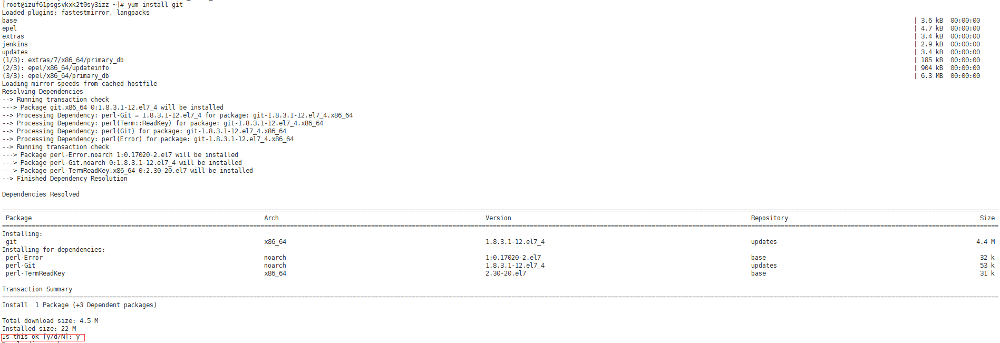
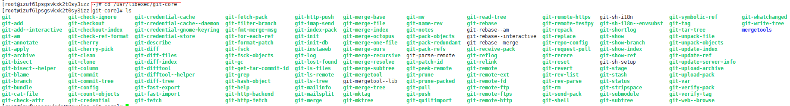

Git是一个开源的分布式版本控制系统，可以有效、高速的处理从很小到非常大的项目版本管理，是目前使用范围最广的版本管理工具。

这篇博客，介绍下Linux下安装Git的步骤，仅供参考，当然，还是yum安装，比较简单方便。。。

更多关于Git的内容，请看下面的链接：

Git官方文档：[Git-Book](https://git-scm.com/book/zh/v2)

Git工作流：[深入理解学习Git工作流](https://segmentfault.com/a/1190000002918123)

 

**1、执行安装**

连接到服务器并登录成功后，输入如下指令，进行下载安装：

 yum install git 

界面显示如下：

出现询问是否下载时，输入y，点击回车，耐心等待安装完成：

 

**2、验证安装结果**

输入命令： git --version ，查看安装的Git版本，验证是否安装成功；

 

**3、查看安装信息**

Git默认安装在/usr/libexec/git-core目录下，可输入指令，查看安装信息：

 

**4、存在的问题**

使用yum安装确实简单方便，但yum存在一个问题就是安装的版本不好控制，如上图所示，安装的版本为1.8.3，这个版本太老了。

登录[github的Git版本发布界面](https://github.com/git/git/releases)，可以看到目前最新的版本为2.17，如下图所示：

如果需要安装最新的版本Git，可以从github下载最新的源码进行编译，然后安装。

 

**5、源码编译安装Git**

大体的安装步骤如下：

①、获取[github](https://github.com/git/git/releases)最新的Git安装包下载链接，进入Linux服务器，执行下载，命令为： wget https://github.com/git/git/archive/v2.17.0.tar.gz ；

②、压缩包解压，命令为： tar -zxvf v2.17.0.tar.gz ；

③、安装编译源码所需依赖，命令为： yum install curl-devel expat-devel gettext-devel openssl-devel zlib-devel gcc perl-ExtUtils-MakeMaker 耐心等待安装，出现提示输入y即可；

④、安装依赖时，yum自动安装了Git，需要卸载旧版本Git，命令为： yum remove git 出现提示输入y即可；

⑤、进入解压后的文件夹，命令 cd git-2.17.0 ，然后执行编译，命令为 make prefix=/usr/local/git all 耐心等待编译即可；

⑥、安装Git至/usr/local/git路径，命令为 make prefix=/usr/local/git install ；

⑦、打开环境变量配置文件，命令 vim /etc/profile ，在底部加上Git相关配置信息：

PATH=$PATH:/usr/local/git/bin

export PATH 

然后保存，退出！

⑧、输入命令 git --version ，查看安装的git版本，校验通过，安装成功。

<a href="https://www.cnblogs.com/imyalost/p/8777684.html">原作者</a>

