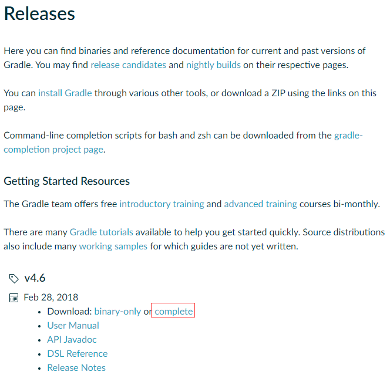
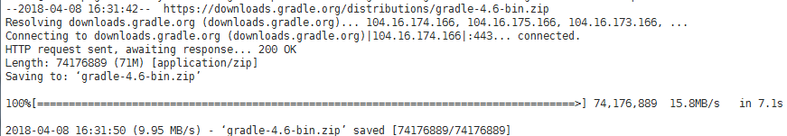
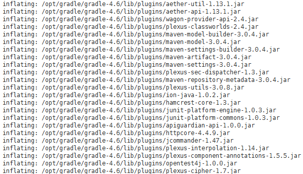
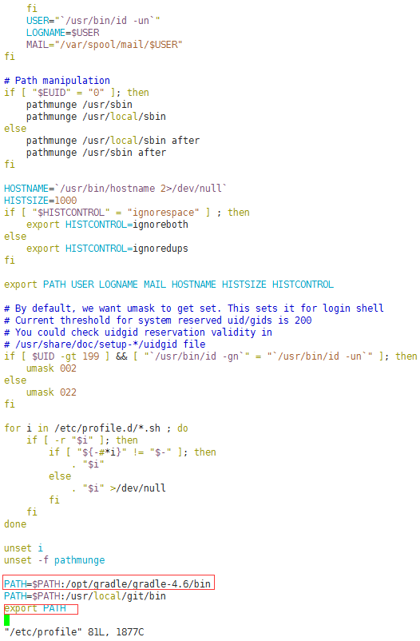
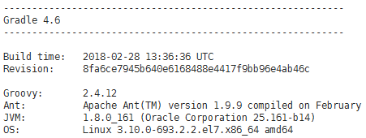

Gradle是一个基于Apache的Ant和Maven的项目自动化构建工具，相比于Ant和Maven的局限性，Gradle可以更好的帮助管理项目中的差异、依赖、编译、打包、部署。

可以自定义满足自己需要的构建逻辑，写入到build.gradle中供日后复用，更好的执行内部依赖、传递依赖管理和任务执行。

这篇博客，介绍下Linux下安装Gradle的步骤，仅供参考。。。

 

**1、下载**

Gradle是基于Ant和Maven的构建工具，同样需要Java运行环境，安装之前需要先安装配置好Java环境，可以参考之前的博客：[Linux下安装JDK](http://www.cnblogs.com/imyalost/p/8709578.html)

Gradle官方下载地址：<https://gradle.org/releases/>

可以看到目前最新的版本已经到了4.6，然后选择下图中圈出的地方，复制下载链接：

 进入Linux服务器，进入安装包下载，输入以下命令：

 wget https://downloads.gradle.org/distributions/gradle-4.6-bin.zip 

耐心等待下载完成，成功后结果如下图：

 

**2、解压安装**

下载完成后，执行下面的命令，将压缩包解压到如下路径：

 unzip -d /opt/gradle gradle-4.6-bin.zip 

解压完成后界面显示如下（解压过程较长，这里只截图最后一部分）：

 

**3、修改配置**

解压完成后，输入命令 vim /etc/profile ，进入配置文件进行编辑，输入下面红色圈出来的内容：

保存退出后，输入刷新命令 source /etc/profile ，刷新配置文件。

 

**4、校验安装结果**

输入命令 gradle --version ，检查安装的Gradle版本号及其他信息，如出现如下信息，则安装完成。

 

以上为在Linux环境中安装Gradle的过程，博客内容仅供参考，请根据自己的实际情况进行适当修改。