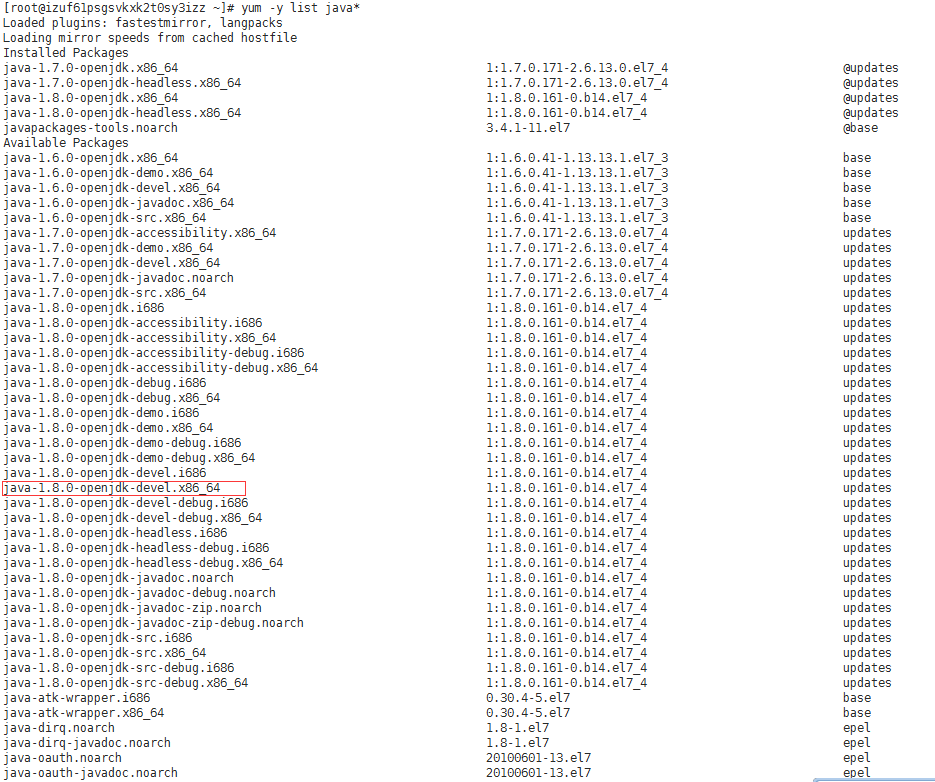
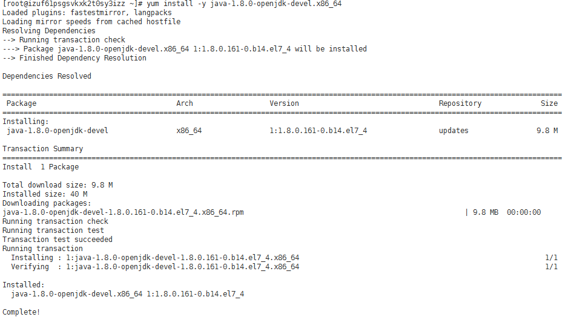
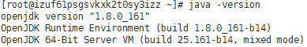
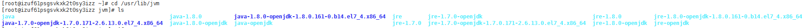
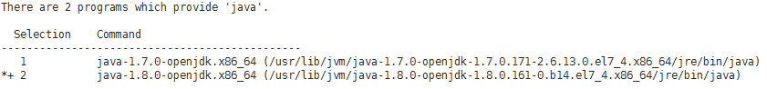

自动化测试的主要目的是为了执行回归测试。当然，为了模拟真实的用户操作，一般都是在UAT或者生产环境进行回归测试。

为了尽量避免内网和外网解析对测试结果的影响，将自动化测试服务部署在外网的服务器是比较好的选择。

今天申请的测试服务器下来了，阿里云的Linux服务器，对我这个很少用Linux的人来说，安装工具就让我很受伤（还是太菜了啊。。。）

这篇博客，将基本的安装步骤整理下，供像我这样的Linux小白参考。。。

 

**1、准备服务器**

这个根据个人情况，可以虚拟机安装也可以从云服务提供商那里租用服务器；

我的服务器版本：CentOS7.4 64位

连接工具：Xshell

具体的连接工具可参考这篇博客：[常用连接Linux工具](https://blog.csdn.net/lijunlinlijunlin/article/details/44664499)

 

**2、查看可用的JDK版本**

登录服务器成功后，输入以下命令，查看支持的JDK版本：

 yum -y list java* 

执行成功后，界面显示如下：

因为服务器版本是64位，我希望安装的是1.8的JDK，因此选择上图中标注出来的版本，进行安装；

**PS：**带-devel的安装的是jdk，而不带-devel的，实际上安装的是jre！

 

**3、安装JDK**

输入以下命令，等待安装完成：

 yum install -y java-1.8.0-openjdk-devel.x86_64 

安装成功后，界面显示如下：

 

**4、验证安装结果**

输入命令： java -version ，查看是否安装成功。本人安装的是1.8版本的JDK，出现的结果如下：

出现这些信息，就表示JDK安装成功。

 

**5、查看JDK版本信息**

如果要查看JDK的安装信息，可以输入以下命令来查看：

 cd /usr/lib/jvm 

进入该安装目录下，输入如下命令：

 ls 

界面显示如下：

 

**6、配置默认JDK版本**

如果你安装了多个不同版本的JDK，可以通过如下命令查看已安装的JDK：

 sudo update-alternatives --config java 

显示界面如下：

如果要保持当前的版本【*】不变，请按回车键，入过要选择其他版本，请输入编号。

