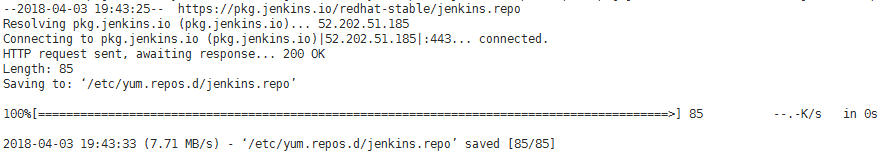
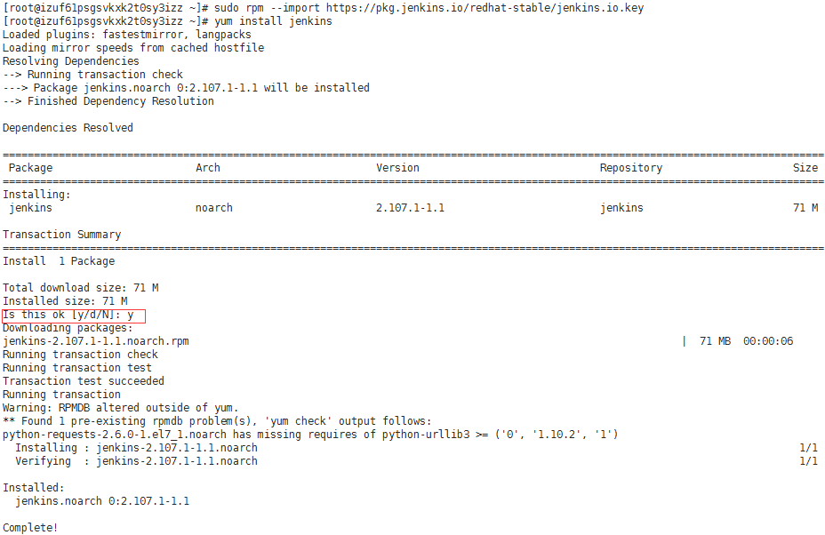
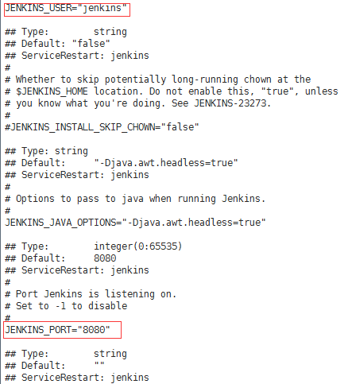
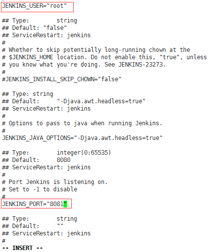
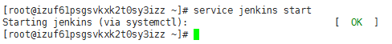

jenkins是一个Java开发的开源持续集成工具，广泛用于项目开发，具有自动化构建、测试和部署等功能，它的运行需要Java环境。

上篇博客介绍了[Linux下安装JDK](http://www.cnblogs.com/imyalost/p/8709578.html)的步骤，这篇博客，介绍下Linux下安装jenkins的步骤，仅供参考。。。

还是使用yum的方式安装，比较简单方便。。。

 

**1、添加存储库**

yum的repo中默认没有Jenkins，需要先将Jenkins存储库添加到yum repos，执行下面的命令：

 sudo wget -O /etc/yum.repos.d/jenkins.repo https://pkg.jenkins.io/redhat-stable/jenkins.repo 

界面如下：

然后执行下面的命令：

 sudo rpm --import https://pkg.jenkins.io/redhat-stable/jenkins.io.key 

 

**2、安装jenkins**

执行安装命令： yum install jenkins

如下图所示，出现询问是否下载时，输入y，然后点击回车，耐心等待安装完成：

 

**3、修改配置**

jenkins安装成功后，默认的用户是jenkins，端口是8080，为了防止冲突，并且给用户赋权限，我们修改用户名和端口。

输入命令，进入jenkins配置文件： vi /etc/sysconfig/jenkins 

界面显示如下：

修改用户名，端口，然后保存，退出；界面如下：

**PS：**移动界面上的光标到需要修改的地方，点击‘x’删除原有的配置，点击‘i’，这时候界面下方会出现一个**-- insert --**，这时候就可以输入需要修改的内容；修改完成后，输入‘wq!’保存！

 

**4、启动服务**

输入命令： service jenkins start 启动服务：

然后在浏览器输入IP+端口，进行插件安装等操作（这里的具体操作可以参考之前的博客：[jenkins简单安装和配置](http://www.cnblogs.com/imyalost/p/8677345.html)）

 

**5、其他常用命令**

查看日志： vi /var/log/jenkins/jenkins.log 

查询系统已有的安装程序： rpm -qa | grep jenkins 