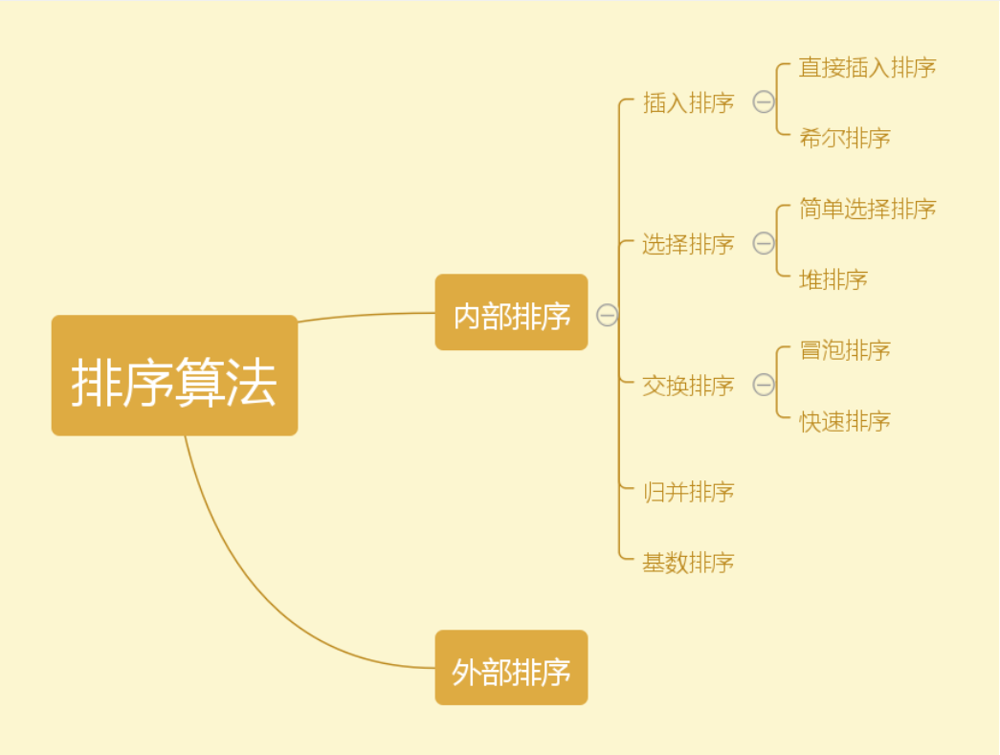

**交换函数：注意要按引用传递，否则无法真正交换两个数的值**

```php
　function exchange(&$a, &$b){
        $temp = $a;
        $a = $b;
        $b = $temp;
    }
```

### 1.冒泡排序

https://www.cnblogs.com/isykw/p/6115461.html


**思路分析**：冒泡排序（Bubble Sort，台湾译为：泡沫排序或气泡排序）是一种简单的排序算法。它重复地走访过要排序的数列，依次比较两个元素，如果他们的顺序错误就把他们交换过来。走访数列的工作是重复地进行直到没有再需要交换，也就是说该数列已经排序完成。这个算法的名字由来是因为越小的元素会经由交换慢慢“浮”到数列的顶端。

步骤：

> 1. 比较相邻的元素。如果第一个比第二个大，就交换他们两个。
> 2. 对每一对相邻元素作同样的工作，从开始第一对到结尾的最后一对。在这一点，最后的元素应该会是最大的数。
> 3. 针对所有的元素重复以上的步骤，除了最后一个。
> 4. 持续每次对越来越少的元素重复上面的步骤，直到没有任何一对数字需要比较。

```
$arr=array(1,43,54,62,21,66,32,78,36,76,39); 
```

```
function bubbleSort($arr)
	{
	//该层循环控制 需要冒泡的轮数
		for ($i=1; $i < count($arr) ; $i++) { 
		  //该层循环用来控制每轮 冒出一个数 需要比较的次数
			for ($y=0; $y < count($arr)-$i; $y++) { 
				if ($arr[$y] > $arr[$y+1]) {
					// 声明一个临时变量
					$tmp = $arr[$y];
					$arr[$y] = $arr[$y+1];
					$arr[$y+1] = $tmp;
				}
			}
		}
		return $arr;
	}
	var_dump(bubbleSort($arr));
```

排序效果图：


### 选择排序

介绍：

选择排序(Selection sort)是一种简单直观的排序算法。它的工作原理如下。首先在未排序序列中找到最小元素，存放到排序序列的起始位置，然后，再从剩余未排序元素中继续寻找最小元素，然后放到排序序列末尾。以此类推，直到所有元素均排序完毕。

```
  //实现思路 双重循环完成，外层控制轮数，当前的最小值。内层 控制的比较次数
   function select_sort($arr) {
  	//$i 当前最小值的位置， 需要参与比较的元素
	 for($i=0, $len=count($arr); $i<$len-1; $i++) {
 	 //先假设最小的值的位置
  		$p = $i;
  		//$j 当前都需要和哪些元素比较，$i 后边的。
  		for($j=$i+1; $j<$len; $j++) {
  			//$arr[$p] 是 当前已知的最小值
 			if($arr[$p] > $arr[$j]) {
 //比较，发现更小的,记录下最小值的位置；并且在下次比较时，应该采用已知的最小值进行比较。
 				$p = $j;
 			}
		}
 		//已经确定了当前的最小值的位置，保存到$p中。
 		//如果发现 最小值的位置与当前假设的位置$i不同，则位置互换即可
 		if($p != $i) {
 			$tmp = $arr[$p];
 			$arr[$p] = $arr[$i];
 			$arr[$i] = $tmp;
 		}
	}
 //返回最终结果
 	return $arr;
 }
```