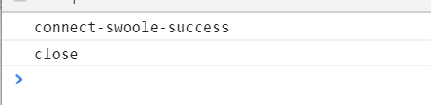

#### 连接websocket

​	<span style="color:red">网页报以下错误请将nignx配置添加标***范围段</span>

​    <a href="https://blog.csdn.net/ItTvibe/article/details/81538096">failed: Error during WebSocket handshake: Unexpected response code: 400</a>

> nignx

```php+HTML
server
{
    listen 80;
    server_name skt.fgj1013.top
	index index.php index.html index.htm default.php default.htm default.html;
    root /www/wwwroot/default/swoole/demo/server/client;
    #SSL-START SSL相关配置，请勿删除或修改下一行带注释的404规则
    #error_page 404/404.html;
    #SSL-END
    
     #ERROR-PAGE-START  错误页配置，可以注释、删除或修改
    error_page 404 /404.html;
    error_page 502 /502.html;
    #ERROR-PAGE-END
    
    #PHP-INFO-START  PHP引用配置，可以注释或修改

	include enable-php-72.conf;
    #PHP-INFO-END
    
    #REWRITE-START URL重写规则引用,修改后将导致面板设置的伪静态规则失效
    include /www/server/panel/vhost/rewrite/skt.fgj1013.top.conf;
    #REWRITE-END
    
    #禁止访问的文件或目录
    location ~ ^/(\.user.ini|\.htaccess|\.git|\.svn|\.project|LICENSE|README.md)
    {
        return 404;
    }
    
    #一键申请SSL证书验证目录相关设置
    location ~ \.well-known{
        allow all;
    }
  location =/ {
        #添加了这个也不行
        #try_files $uri $uri/ /index.php?$query_string; 

        #下面这几行是swoole官网设定
        if (!-e $request_filename) {
            proxy_pass http://127.0.0.1:9501;
        }
	************************websocket必须配置*****************************************
        #通信时使用HTTP / 1.1这是WebSockets所必需的
        proxy_http_version 1.1;
        #接下来俩行Nginx响应升级请求，当浏览器想要使用WebSocket时，该请求由HTTP启动
        proxy_set_header Upgrade $http_upgrade;
        proxy_set_header Connection "upgrade";
*****************************websocket必须配置******************************************
        proxy_set_header Connection "keep-alive";
        proxy_set_header X-Real-IP $remote_addr;    
    }

    location ~ .*\.(gif|jpg|jpeg|png|bmp|swf)$
    {
        expires      30d;
        error_log off;
        access_log off; 
    }
    location ~ .*\.(js|css)?$
    {
        expires      12h;
        error_log off;
        access_log off; 
    }
	access_log  /www/wwwlogs/skt.fgj1013.top.log;
    error_log  /www/wwwlogs/skt.fgj1013.top.error.log;
}
```

> 服务端代码 server 过程化

```
<?php

$server = new Swoole\WebSocket\Server("0.0.0.0", 9501);

$server->on('open', function (Swoole\WebSocket\Server $server, $request) {
    echo "server: handshake success with fd{$request->fd}\n";
});

$server->on('message', function (Swoole\WebSocket\Server $server, $frame) {
    echo "receive from {$frame->fd}:{$frame->data},opcode:{$frame->opcode},fin:{$frame->finish}\n";
    $server->push($frame->fd, "this is server");
});

$server->on('close', function ($ser, $fd) {
    echo "client {$fd} closed\n";
});

$server->start();
```

```
/**
 * websockt 连接对象化
 * Class Websocket
 * @author 范国洁
 */

class Websocket
{
    CONST HOST = '0.0.0.0';
    CONST PORT = '9501';
    public $ws = null;

    public function __construct()
    {
        $this->ws = new swoole_websocket_server(self::HOST,self::PORT);
        $this->ws->on('open',[$this,'onOpen']);
        $this->ws->on('message',[$this,'onMessgae']);
        $this->ws->on('close',[$this,'onClose']);
        $this->ws->start();
    }

    /**
     * 监听ws 连接事件
     * @param $ws
     * @param $request
     */
    public function onOpen($ws,$request)
    {
        var_dump($request->fd);
    }

    /**
     * 监听ws消息事件
     * @param $ws
     * @param $frame
     */
    public function onMessgae($ws,$frame)
    {
        echo "ser-push-message:{$frame->data}\n";
        $ws->push($frame->fd,'server-push:'.date('Y-m-d H:i:s'));
    }

    /**
     * close
     * @param $ws
     * @param $fd
     */
    public function onClose($ws,$fd)
    {
        echo "clientid:{$fd}\n";
    }

}
```


<!DOCTYPE html>
<html>
<head>
	<title></title>
</head>
<body>
	<h1>websockt</h1>
	<script type="text/javascript">
		var wsUrl = "ws://skt.fgj1013.top";
		var websockt = new WebSocket(wsUrl);
		websockt.onopen = function(evt){
			console.log("connect-swoole-success");
		}
		websockt.onmessage = function(evt){
			console.log("ws-server-return-data:"+evt.data)
		}
		websockt.onclose = function(evt){
			console.log('close')
		}
     </script>
</body>
</html>

