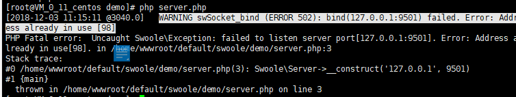

#### [bind (ERROR 502): bind(0.0.0.0:9501) failed. Error: Address already in use [98\] （端口被占用）]

运行 swoole_server 服务报错显示端口被占用

Solved

>  1.用命令查看该端口 看是否存在

`	netstat  -anp  |  grep 9501`

> 2.如果存在 就用 kill对应端口号 把该进程杀死

 `kill 6554`

没有显示 连接结果 就是说明已经被杀死了