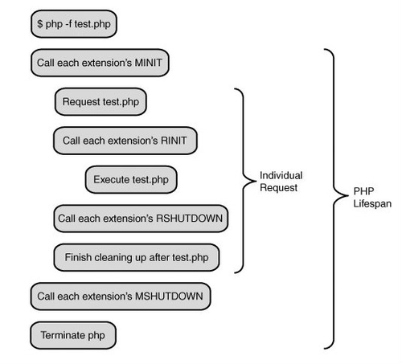

https://yq.aliyun.com/articles/44248?spm=a2c4e.11153940.blogcont330012.26.14a06cceRAOW7r

PHP是最好的语言，Swoole重新定义了最好的语言，这当然是个梗了，不过php做为一个入门低、开发快、执行效率高的一门语言，而在以快速著称的pc互联网时代，无可争议的成为首选，这是php的优势，然后优势慢慢转化为思维定势，在很多工程师看来php开发就等同于web开发，然而如今已经是移动互联的时代，物联网，智能硬件也如火如涂，好像PHP不是那么受待见了（ps:一直如此），而swoole的出现，成功突破了这一思维定势，使phper可以从web开发跳出，进入了更大的服务器网络编程领域，但web开发和服务器网络编程在开发思维上还是有很大的不同，本系列文章将通过swoole的介绍，帮助大家做思维转换，从而进入一个新天地。

PHP与SWOOLE的关系
swoole是php的一个扩展，纯c开发，主要是为了补充php在网络编程方面的不足

PHP与SWOOLE的运行模式
php做为swoole的宿主，所以了解php本身的运行模式是必不可少的，下图是以cli下执行一个php文件时的完整流程

 

这上层有个SAPI的概念，SAPI是php给外部环境能够执行php内核提供的一个统一接口,我们常见的三种SAPI有cli, php-fpm, mod_php。

在这里，以fpm为例，把运行周期的关键5步拿出来：
1MINIT
在这步（包括之前）php引擎会初始化一些公用配置，读取ini文件，加载zend引擎，执行所以模块的MINIT模块，然后就长驻在fpm进程中，然后就等待处理请求
2RINIT
在每个请求过来之后，会调用所有模块的RINIT进行一些请求内数据的初始化，比如一些超全局变量，一些模块数据初始化等
3执行php
然后在这加载php文件，进行词法，语法分析，生成opcode代码，交由zend vm执行, 暂存执行结果
4RSHUTDOWN
在把结果返回给fpm之前，会调用所有模块的RSHUTDOWN模块进行一些数据的回收，zend vm也会关闭打开的数据流，进行内存释放等操作，然后把暂存的执行结果flush输出
5MSHUTDOWN
这一阶段在重启fpm时发生，会调用所有模块的MSHUTDOWN,关闭zend引擎等操作
到这，可以得到一些结论：
fpm每个请求都是在执行2~4步
opcode cache是把第3步的词法分析、语法分析、生成opcode代码这几个操作给缓存起来了，从而达到加速的作用

几个误区：
1请求都是独立的，不能进行数据共享? 其实还是有办法进行在数据共享的，那就是在MINIT这步，因为这一步的数据是长驻在fpm进程中，比较典型的是ini配置文件，我没看过鸟哥新出的yaconf, 不过我猜测yaconf的配置读取也应该是放在这一步进行

2每个请求都能独立释放内存, 所以总体是安全的。（这也是大多数phper没有关闭资源的习惯，如[MySQL](http://lib.csdn.net/base/14) close等），那这也是有问题的，很有可能在扩展层有内存泄漏的存在，所以fpm提供max_reuqest来重启fpm，达到完全释放内存的目的，当然总体而言，php在内存控制方面还是相当不错的。
OK, 我们分析出了php的基本流程，那swoole是在哪一步执行的呢？首先，swoole运行有个前提条件：必需在cli模式下执行. 然后在第3步，swoole就接管了php，进入了swoole的生命周期了。swooele的生命周期以多进程模式为例，如下：
1onStart
在回调此函数之前Swoole Server已进行了如下操作
已创建了manager进程,已创建了worker子进程,已监听所有TCP/UDP端口,已监听了定时器
此函数是在主进程回调的，和worker进程的onWorkStart是并行的没有先后之分，在此回调里强烈要求只做log记录，设置进程名操作，不做业务逻辑,否则业务逻辑代码的错误导致master进程crash,让整个swoole server不对对外提供服务了。

2onWorkStart
每个worker或task进程在启动之后，会回调此函数，由于此回调类似于fpm里的MINIT，所以可以在这里做一个全局的资源加载，框架初始化之类的操作，这样可以对每个请求做全局共享，而达到提升性能的目的

3onReceive
每个请求（也称数据到达），会回调此函数，然后进行业务逻辑处理，输出结果

4onWorkerStop
worker退出时，会回调此函数。

5onShutDown
swoole服务停止回调此函数,然后继续fpm的第4、5步，进而退出PHP生命周期。   