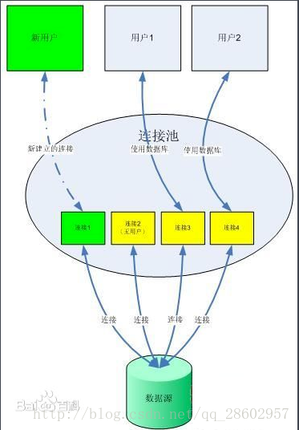

##### MySQL连接池

**在传统的网站开发中，比如LNMP模式，由[Nginx](https://www.baidu.com/s?wd=Nginx&tn=24004469_oem_dg&rsv_dl=gh_pl_sl_csd)的master进程接收请求然后分给多个worker进程，**

**每个worker进程再链接php-fpm的master进程，php-fpm再根据当前情况去调用其worker进程然后**

**处理PHP，如果需要MySQL，在与MySQL建立连接，这个时候，如果有1000个请求打过来，就需要**

**与MySQL建立1000个连接。如果请求达到万级或者百万级，这时数据库的压力就会非常大了。连接**

**池技术就可以派上用场了，可以大大降低数据库连接数，还可以降低IO消耗。**


## 为什么可以降低IO消耗？

MySQL短连接每次请求操作数据库都需要建立与MySQL[服务器](https://www.baidu.com/s?wd=%E6%9C%8D%E5%8A%A1%E5%99%A8&tn=24004469_oem_dg&rsv_dl=gh_pl_sl_csd)建立TCP连接，这是需要时间开销的。TCP连接需要3次网络通信。这样就增加了一定的延时和额外的IO消耗。请求结束后会关闭MySQL连接，还会发生3/4次网络通信。

而连接池采用的是MySQL的长连接模式，会一直保持与MySQL的连接，重用连接进行MySQL的操作，从而节省了建立连接和断开连接的消耗。

## 为什么可以降低数据连接数呢？



数据的连接池为维持若干个长连接，当新请求到达的时候，如果连接池空闲，就分配给连接池去处理，否则，后面的数据库连接请求将被加入到等待队列中。

# 用swoole实现一个简单的MySQL连接池

```
<?php
$serv = new swoole_server('0.0.0.0', 9509);
$serv->set(array(
    'worker_num' => 50, //worker进程数量
    'task_worker_num' => 10, //task进程数量 即为维持的MySQL连接的数量
));

function my_onReceive($serv, $fd, $from_id, $data)
{
    echo "收到数据".$data.PHP_EOL;
    //taskwait就是投递一条任务，这里直接传递SQL语句了
    //然后阻塞等待SQL完成，并返回结果
    $result = $serv->taskwait($data);
    echo "任务结束".PHP_EOL;
    if ($result !== false) {
        list($status, $db_res) = explode(':', $result, 2);
        if ($status == 'OK') {
            //数据库操作成功了，执行业务逻辑代码，这里就自动释放掉MySQL连接的占用
            //将处理结果发送给客户端
            $serv->send($fd, var_export(unserialize($db_res), true) . "\n");
        } else {
            $serv->send($fd, $db_res);
        }
        return;
    } else {
        $serv->send($fd, "Error. Task timeout\n");//如果返回的是false，则说明taskwait等待超时，可以设置相应的等待超时时间
    }
}

function my_onTask($serv, $task_id, $from_id, $sql)
{
    echo "开始做任务 task id:".$task_id.PHP_EOL;
    static $link = null;
    HELL:
    if ($link == null) {
        $link = @mysqli_connect("127.0.0.1", "root", "passwd", "database");
        if (!$link) {
            $link = null;
            $serv->finish("ER:" . mysqli_error($link));
            return;
        }   
    }   
    $result = $link->query($sql);
    if (!$result) { //如果查询失败了
        if(in_array(mysqli_errno($link), [2013, 2006])){//错误码为2013，或者2006，则重连数据库，重新执行sql
                $link = null;
                goto HELL;
        }else{
            $serv->finish("ER:" . mysqli_error($link));
            return;
        }
    }
    if(preg_match("/^select/i", $sql)){//如果是select操作，就返回关联数组
        $data = $result->fetch_assoc();
    }else{//否则直接返回结果
        $data = $result;
    }
    $serv->finish("OK:" . serialize($data));//调用finish方法，用于在task进程中通知worker进程，投递的任务已完成
    //return "OK:".serialize($data);
}

function my_onFinish($serv, $task_id, $data)
{
    echo "任务完成";//taskwait 没有触发这个函数。。
    echo "AsyncTask Finish:Connect.PID=" . posix_getpid() . PHP_EOL;
}

$serv->on('receive', 'my_onReceive');
$serv->on('task', 'my_onTask');
$serv->on('Finish', 'my_onFinish');

$serv->start();//启动server
```

> **写了个客户端代码来做测试**

```
<?php
$client = new swoole_client(SWOOLE_SOCK_TCP);//创建swoole tcp客户端
$client->connect('*.*.*.*', 9509, 10) or die("连接失败");//连接server
while(true){
    echo "请输出要执行的sql: ";
    $sql = trim(fgets(STDIN));
    if($sql=='exit'){
        break;
    }   
    $client->send($sql);//发送要执行的sql
    $data = $client->recv();//阻塞接受返回的结果
    var_dump($data);//打印
}
$client->close();//关闭连接

```

> **运行，首先启动server**

```
[root@VM_114_93_centos swoole]# php DBserver_task.php
```

> **然后运行client**

```
[root@VM_114_93_centos swoole]# php DBclient.php 
请输出要执行的sql: select * from s_lvs_vip;
string(103) "array (
  0 => 
  array (
    'id' => '3',
    'protocol' => 'tcp',
    'lb_algo' => 'ip_hash',
  ),
)
"
请输出要执行的sql: insert into s_lvs_vip set protocol='tcp',lb_algo='ip_hash';
string(5) "true
"
请输出要执行的sql: select * from s_lvs_vip;
string(196) "array (
  0 => 
  array (
    'id' => '3',
    'protocol' => 'tcp',
    'lb_algo' => 'ip_hash',
  ),
  1 => 
  array (
    'id' => '4',
    'protocol' => 'tcp',
    'lb_algo' => 'ip_hash',
  ),
)
"
请输出要执行的sql: delete from s_lvs_vip where id=3;
string(5) "true
"
请输出要执行的sql: select * from s_lvs_vip;
string(103) "array (
  0 => 
  array (
    'id' => '4',
    'protocol' => 'tcp',
    'lb_algo' => 'ip_hash',
  ),
)
"
请输出要执行的sql: exit

```

> **在看server端的输出结果：**

```
[root@VM_114_93_centos swoole]# php DBserver_task.php 
收到数据select * from s_lvs_vip;
开始做任务 task id:0
任务结束
收到数据insert into s_lvs_vip set protocol='tcp',lb_algo='ip_hash';
开始做任务 task id:1
任务结束
收到数据select * from s_lvs_vip;
开始做任务 task id:2
任务结束
收到数据delete from s_lvs_vip where id=3;
开始做任务 task id:3
任务结束
收到数据select * from s_lvs_vip;
开始做任务 task id:4
任务结束

```

# 性能测试

同样执行一条查询

不用连接池的PHP代码

```
<?php
$conn = @mysqli_connect("***.***.***.***","root","905407339",'hulk');
if($conn){
    //mysqli_select_db($conn,"hulk");
    $res=mysqli_query($conn,'select * from s_lvs_vip');
    $row=mysqli_fetch_assoc($res);
    var_dump($row);
}else{
    echo "ERROR";
}
```

用连接池的PHP代码

```
<?php
$sql = 'select * from s_lvs_vip';
$client = new swoole_client(SWOOLE_SOCK_TCP);
$client->connect('***.***.***.***', 9509, 10) or die("连接失败");
$client->send($sql);
$data = $client->recv();
var_dump($data);
$client->close();

```

都用2000并发去测试多次，取平均值

```
ab -n 2000 -c 100 http://***.***.***.***/swoole/mysqli.php
ab -n 2000 -c 100 http://***.***.***.***/swoole/DBclient.php
```

# 补充

<a href="./error/mysql官方关于2013和2006错误代码产生原因和解决方案.md">断线重连</a>

造成这样的原因一般是sql操作的时间过长，或者是传送的数据太大。

在mysql中有一个wait_timeout参数，默认设置为8个小时，当超过8个小时没有数据交互时，mysql服务器会主动关闭掉超时的连接，对应的mysql 错误码是2006，报错为MySQL server has gone away，当查询的结果集超过 max_allowed_packet 也会出现这样的报错

错误：2013 (CR_SERVER_LOST) 
消息：查询过程中丢失了与MySQL服务器的连接。

