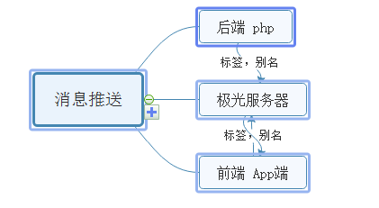

# Thinkphp 实现极光推送

php运行环境：PHP/5.3.28
JPush PHP SDK : v3 分支的代码 (PHP低于5.3.3)
SDK路径：<https://github.com/jpush/jpush-api-php-client/tree/v3>

对我而言耗时点：前端，后端，极光推送之间的逻辑关系



(误区：php与前端app要对接，其实不要直接对接，php直接调用极光服务器就可以了)

#### PHP服务端准备的工作：

得到SDK代码压缩包，解压后，里面很多文件都是不需要的（里面也有案例可以借鉴），找到核心代码文件“jpush-api-php-client-3\src\JPush” ，将其放在Thinkphp 核心文件Core/Extend/Vendor/JPush2(可重命名)/下。
在JPush2下新建一个php文件：MsgPush.php


在这个文件中封装一个类，将可能用到的方法都写上，以便调用

```
<?php
require_once("JPush/JPush.php");
class MsgPush{
    
   //appkey
    static public function app_key(){
 
        $app_key = "111111111111111111111111";//极光官网分配的
        return $app_key;
    }

    //master_secret,用于服务器端API调用时与Appkey 配合使用达到鉴权的目的
    static public function master_secret(){
 
        $master_secret = "222222222222222222";//极光官网分配的
        return $master_secret;
    }

    //将json格式转换成数组格式
    function json_array($result){
        $result_json = json_encode($result);
        return json_decode($result_json,true);
    }
        
    //获取alias和tags
    public function getDevices($registrationID){
 
        $app_key = $this->app_key();
        $master_secret = $this->master_secret();
 
        $client = new JPush($app_key, $master_secret);
 
        $result = $client->device()->getDevices($registrationID);
        
        return $result;
 
    }

    //添加tags
    public function addTags($registrationID,$tags){
 
        $app_key = $this->app_key();
        $master_secret = $this->master_secret();
 
        $client = new JPush($app_key, $master_secret);
 
        $result = $client->device()->addTags($registrationID,$tags);
        
        return $result;
 
    }
 
    //移除tags
    public function removeTags($registrationID,$tags){
 
        $app_key = $this->app_key();
        $master_secret = $this->master_secret();
 
        $client = new JPush($app_key, $master_secret);
 
        $result = $client->device()->removeTags($registrationID,$tags);
        
        return $result;
 
    }

    //标签推送
    public function pushTag($tag,$content){
 
        $app_key = $this->app_key();
        $master_secret = $this->master_secret();
 
        $client = new JPush($app_key, $master_secret);
 
        $tags = implode(",",$tag);
 
        $client->push()
                ->setPlatform(array('ios', 'android'))
                ->addTag($tags)                          //标签
                ->setNotificationAlert($content)           //内容
                ->send();
                
        return json_array($result);
 
    }
 
    //别名推送
    public function pushAlias($userids,$content){
 
        $app_key = $this->app_key();
        $master_secret = $this->master_secret();
 
        $client = new JPush($app_key, $master_secret);
        $alias = implode(",",$userids);
 
        $result = $client->push()
                ->setPlatform(array('ios', 'android'))
                ->addAlias($alias)                      //别名
                ->setNotificationAlert($content)        //内容
                ->send();
                
         return json_array($result);
 
    }
    
    //向所有设备推送消息（用于开发阶段的测试）
    function sendNotifyAll($message){
        $message = "测试推送所有设备";
        $app_key = $this->app_key();
        $master_secret = $this->master_secret();
        $client = new JPush($app_key, $master_secret);
        $result = $client->push()
                ->setPlatform('all')
                ->addAllAudience()                      //别名
                ->setNotificationAlert($message)        //内容
                ->send();
        return json_array($result);
    }
}

?>
```

项目中的调用

```
/**
     * 执行推送任务
     */
    public function PushInfoMatter($alias,$content){

      //引入极光推送SDK
      vendor("JPush2.MsgPush");
      //实例化极光推送类
      $pushmodel = new MsgPush();
      //调用别名推送方法
      $res = $pushmodel -> pushAlias($alias,$content); 
      return $res;

   }
```

#### 前端准备的工作：

在用户登录时做以下处理
1.获取应用设备id,给应用添加别名或标签
2.将设置的别名传到极光服务器
3.将用户信息与对应的设备号，别名，登录状态等信息存到公司的服务器中，以便他用

最后，我用的是定时器任务去触发任务。不知道你们用的是什么方法来触发消息通知任务。

（下一篇，实现定时任务触发任务）

20180726代码优化

```
require_once("JPush/JPush.php");
class MsgPush{
    
  //appkey
  private $_app_key;

  //master_secret,
 private $_master_secret;

  //$_push_client
 private $_push_client = null;

  //构造函数
  public function __construct($_app_key,$_master_secret){
      $this ->_app_key = $_app_key;
      $this ->_master_secret = $_master_secret;
      $this ->_push_client = new JPush($this ->_app_key,$this ->_master_secret );
  }

    //将json格式转换成数组格式
    function json_array($result){
        $result_json = json_encode($result);
        return json_decode($result_json,true);
    }
        
    //获取alias和tags
    public function getDevices($registrationID){
 
        $result =$this ->_push_client->device()->getDevices($registrationID);
        
        return $result;
 
    }

    //添加tags
    public function addTags($registrationID,$tags){
 
        $result = $this ->_push_client->device()->addTags($registrationID,$tags);
        
        return $result;
 
    }
 
    //移除tags
    public function removeTags($registrationID,$tags){
 
        $result = $this ->_push_client->device()->removeTags($registrationID,$tags);
        
        return $result;
 
    }

    //标签推送
    public function pushTag($tag,$content){

        $tags = implode(",",$tag);
 
        $result = $this ->_push_client->push()
                ->setPlatform(array('ios', 'android'))
                ->addTag($tags)                          //标签
                ->setNotificationAlert($content)           //内容
                ->send();
                
        return json_array($result);
 
    }
 
    //别名推送
    public function pushAlias($userids,$content){
        $alias = implode(",",$userids);
 
        $result = $this ->_push_client->push()
                ->setPlatform(array('ios', 'android'))
                ->addAlias($alias)                      //别名
                ->setNotificationAlert($content)        //内容
                ->send();
                
         return json_array($result);
 
    }
    
    //向所有设备推送消息（用于开发阶段的测试）
    function sendNotifyAll($message){
        $message = "测试推送所有设备";
        $result = $this ->_push_client->push()
                ->setPlatform('all')
                ->addAllAudience()                      //别名
                ->setNotificationAlert($message)        //内容
                ->send();
        return json_array($result);
    }
}
```