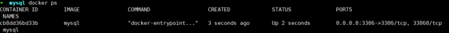
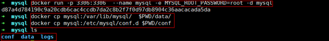
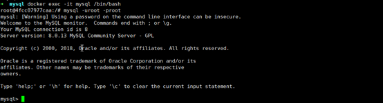

**一、准备工作**--<https://jlmvp.cn/detail?id=17>

**1、安装docker和git**

```bash
apt-get install docker.io

apt-get install git
```

**2、创建环境根目录：**


```
mkdir -p /wwwroot/server && cd /wwwroot/server
```

**二、安装MySQL（8.0+）**

1、

```
docker pull mysql:latest(拉取最新镜像，可以修改为你需要的版本号)

docker images(查看镜像)
```


  

**2、创建mysql所需文件及目录:**


```
mkdir mysql && cd mysql/ (在server下目录安装)

mkdir logs
```

**3、运行一个mysql容器将里面的默认配置copy出来**


```
docker run -p 3306:3306 --name mysql -e MYSQL_ROOT_PASSWORD=root -d mysql
```

启动成功后：



将容器里的配置copy出来：

```bash
docker cp mysql:/var/lib/mysql/  $PWD/data/
docker cp mysql:/etc/mysql/conf.d $PWD/conf
```



```bash
ojbk!!!  Copy完删除这个容器吧
docker rm -f mysql
```

重新运行一个新的mysql容器:

```bash
docker run -p 3306:3306 --name mysql -v $PWD/conf:/etc/mysql/conf.d -v $PWD/logs:/logs -v $PWD/data:/var/lib/mysql
 -e MYSQL_ROOT_PASSWORD=root -d mysql
ok 进入容器登录mysql试试
docker exec -it mysql(容器名称或id) /bin/bash
```



```bash
退出容器  exit或者ctrl+d
```

命令说明：

·        **-p 3306:3306**：将容器的 3306 端口映射到主机的 3306 端口。

·        **--name** **：**指定当前容器名称。

·        **-v $PWD/conf:/etc/mysql/conf.d**：将主机当前目录下的 conf/my.cnf 挂载到容器的 /etc/mysql/my.cnf。

·        **-v $PWD/logs:/logs**：将主机当前目录下的 logs 目录挂载到容器的 /logs。

·        **-v $PWD/data:/var/lib/mysql** ：将主机当前目录下的data目录挂载到容器的 /var/lib/mysql 。

·        **-e MYSQL_ROOT_PASSWORD=root****：**初始化 root 用户的密码。