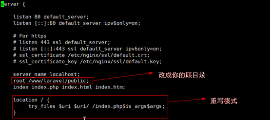
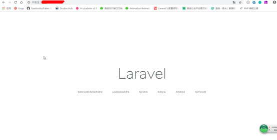

**因为php环境在容器里，所以使用composer需进入容器包括以后的php artisan…命令（目前还没找到好的解决办法）**


**1、在php容器中安装composer**


```bash
curl -sS https://getcomposer.org/installer | php
mv composer.phar /usr/bin/composer
composer config -g repo.packagist composer
```

**2、在php容器中安装git**


```bash
apt-get update && apt-get install git
composer create-project laravel/laravel="5.7.*" laravel --prefer-dist
****这里运行会报错 缺少 zip扩展****
docker-php-ext-install zip
```

**3、修改nginx配置文件**


```
vim /wwwroot/server/nginx/conf.d/default.conf
```



```
chmod -R 777 /wwwroot/server/project/laravel/
```

**4、重启nginx**


```
docker restart mynginx
```

**5、访问服务器**

