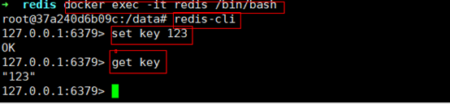

```
docker pull redis
```


```
mkdir redis && cd redis(在server下目录安装)
```


```bash
docker run --name redis -p 6379:6379 -v $PWD/data:/data  -d redis redis-server --appendonly yes
```


```bash
redis-server --appendonly yes : 在容器执行redis-server启动命令，并打开redis持久化配置
```


  

进入容器测试

