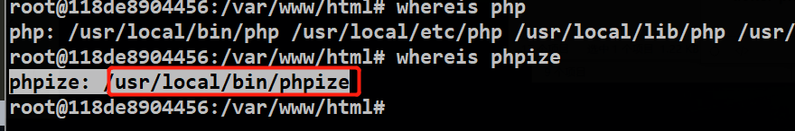
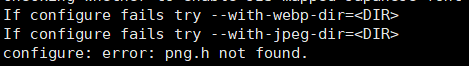
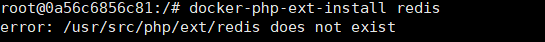
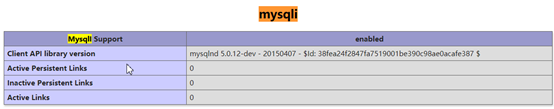

**1、进入php容器**


```
docker exec -it php7.2 /bin/bash (这里容器的名称请自行替换)
```

**1-1安装yaf 扩展**

```bash
curl -fsSl 'http://pecl.php.net/get/yaf-3.0.8.tgz' -o yaf.tar.gz
tar zxvf yaf.tar.gz

whereis phpize 
 下图
cd yaf-3.0.8/
/usr/local/bin/phpize 生成configure

docker-php-ext-configure   /var/www/html/yaf-3.0.8/
docker-php-ext-install     /var/www/html/yaf-3.0.8/

php-m 查看
exit 或者ctrl+D 
docker restart php7.2(容器名称或者id)
```


**2、安装mysqli和pdo_mysql**


```
docker-php-ext-install mysqli pdo_mysql
```

 **doker-php-ext-install 仅支持部分核心扩展的安装***


**3、安装GD**

*安装GD的时候会提示这样的错误*



*1) 安装依赖*


```
apt-get update -y && apt-get install -y libpng-dev
```

2)

```
docker-php-ext-install gd
```

**4、安装phpredis**


用docker安装方式安装不了redis



用以下方式安装

```
curl -L -o /tmp/redis.tar.gz https://github.com/phpredis/phpredis/archive/3.1.3.tar.gz
```


```
cd /tmp && tar zxvf redis.tar.gz
mv /tmp/phpredis-3.1.3 /usr/src/php/ext/redis（如果提示目录不存在先执行一次docker-php-ext-install）
docker-php-ext-install redis
```


ctrl+d 退出容器，然后重启php容器服务


```
docker restart php7.2
```

