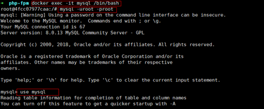
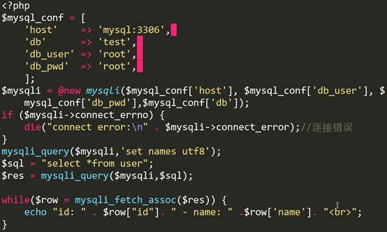
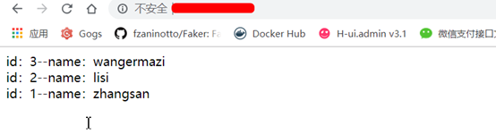

**1、由于MySQL8.0+用户验证方式变了，所以修改你登录用户的验证方式**

进入mysql容器 登录mysql，修改root用户




```
ALTER USER 'root'@'%' IDENTIFIED WITH mysql_native_password BY 'root';
```

**2、创建数据库和测试表**

```
create database test;
CREATE TABLE `user` (
  `id` int(11) NOT NULL AUTO_INCREMENT,
  `name` varchar(255) NOT NULL DEFAULT '',
   PRIMARY KEY (`id`)
 ) ENGINE=MyISAM AUTO_INCREMENT=4 DEFAULT CHARSET=utf8;
INSERT INTO `user` VALUES ('1', 'zhangsan');
INSERT INTO `user` VALUES ('2', 'lisi');
INSERT INTO `user` VALUES ('3', 'wangermazi');
flush privileges;
```

**3、退出容器，重启mysql容器**

```
docker restart mysql
cd /wwwroot/server/project/
vim index.php
```

**4、写入以下测试代码**



**5、访问数据**

