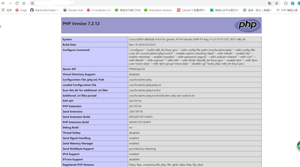

**1、拉取nginx镜像**


```
docker pull nginx
```


**2、创建nginx目录**


```
mkdir nginx && cd nginx (在server下目录安装)
```


**3、运行一个临时nginx容器**


```
docker run -it --name testnginx -p 80:80 -d nginx
```


**4、把里面的默认文件copy出来nginx.conf**


```
docker cp testnginx:/etc/nginx/nginx.conf nginx.conf
```


**5、删除临时文件**


```
docker rm -f testnginx
```


**6、运行新的nginx容器**


```
docker run -p 80:80 --name mynginx -v /wwwroot/server/project:/www -v $PWD/conf.d:/etc/nginx/conf.d 
-v $PWD/logs:/wwwlogs -v $PWD/nginx.conf:/etc/nginx/nginx.conf --link php7.2  -d nginx
```


**7、修改nginx配置文件**


```
cd conf.d
vim default.conf
加入你的server配置文件一下是我的配置
server {
 
    listen 80 default_server;
    listen [::]:80 default_server ipv6only=on;
 
    # For https
    # listen 443 ssl default_server;
    # listen [::]:443 ssl default_server ipv6only=on;
    # ssl_certificate /etc/nginx/ssl/default.crt;
    # ssl_certificate_key /etc/nginx/ssl/default.key;
 
server_name localhost;
###注意 这里写的是nginx容器中的目录
    root /www;
    index index.php index.html index.htm;
 
    location / {
         try_files $uri $uri/ /index.php$is_args$args;
    }
 
    location ~ \.php$ {
        try_files $uri /index.php =404;
        #php7.2就是你安装php的时候link的名字
        fastcgi_pass php7.2:9000;
        fastcgi_index index.php;
        fastcgi_buffers 16 16k;
        fastcgi_buffer_size 32k;
        fastcgi_param SCRIPT_FILENAME $document_root$fastcgi_script_name;
        #fixes timeouts
        fastcgi_read_timeout 600;
        include fastcgi_params;
    }
 
    location ~ /\.ht {
        deny all;
    }
 
    location /.well-known/acme-challenge/ {
        root /var/www/letsencrypt/;
        log_not_found off;
    }
}
```


**8、重启nginx**


```
docker restart mynginx
```


**9、测试**


```
cd /wwwroot/server/project
echo '> index.php
```


**10、访问你的服务器**

