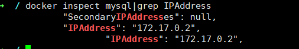
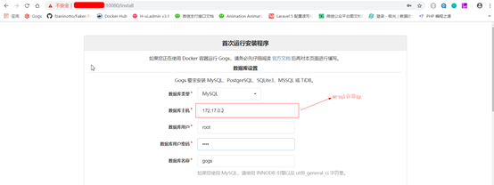
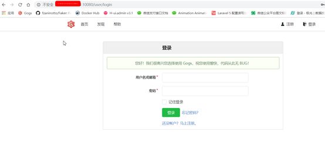
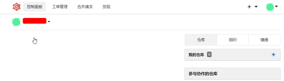
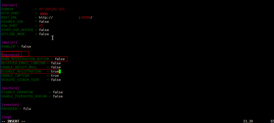
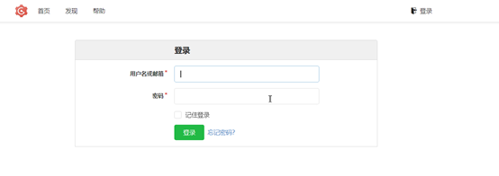
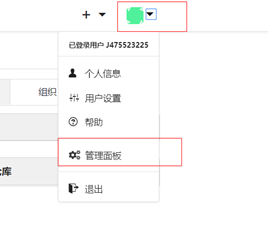
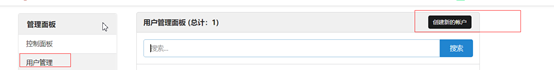

### 1、拉取并运行MySQL镜像

```
docker pull mysql:5.7
```


```
docker run -p 3307:3306 --name mysql57 -e MYSQL_ROOT_PASSWORD=root -d mysql:5.7
```

### 2、创建Gogs数据库

1、进入mysql

```
docker exec -it mysql57 /bin/bash
```

2、登录mysql

```
mysql -uroot -proot
```

3、创建gogs数据库

```
CREATE DATABASE gogs CHARACTER SET utf8 COLLATE utf8_bin;
```


```
GRANT ALL PRIVILEGES ON gogs.* TO ‘root’@‘localhost’ IDENTIFIED BY 'root';
```


```
FLUSH PRIVILEGES;
```


```
\q;
```


4、ctrl+d 退出容器

### 3、拉取并运行Gogs容器

```
docker pull gogs/gogs
```


```
docker run --name=gogs -p 10080:3000 -v /opt/docker/gogs:/data -d gogs/gogs
```

###  

### 4、查询你mysql容器的ip

```
docker inspect mysql|grep IPAddress
```



### 5、访问你服务器的10080端口进行安装



配置完之后点击最下方立即安装到达登录页面



******第一个注册的用户是管理员*********

自己注册账号 然后登录



### 6、修改gogs配置文件隐藏注册（只有管理员可以添加用户）

1、修改配置文件



添加一行：SHOW_REGISTRATION_BUTTON = false

修改DISABLE_REGISTRATION = true

Gogs配置手册：

https://github.com/gogs/docs/blob/master/zh-CN/advanced/configuration_cheat_sheet.md

 

2、保存退出  重启gogs

```
docker restart gogs
```

3、查看首页此时已经没有注册了



4、创建新用户

​       登录你的管理员账号





