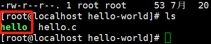
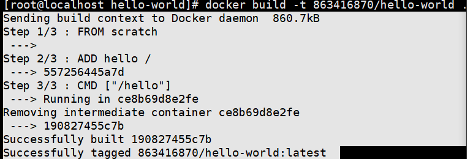

### DIY docker image 

mkdir hello-world

touch hello.c

vim hello.c

```c
#include<stdio.h>
int main()
{
    sprintf("hello");
}

```

确保安装

```
 yum install gcc  

yum install glibc-static
```

执行

```
gcc -static hello.c -o hello 会编译生成 hello 可执行文件[./hello] 
```



```
touch Dockerfile
vim Dockerfile
i
FROM scratch
ADD hello / 
CMD ["/hello"]

```

**开始构建**

```shell
docker build -t 863416870/hello-world .    .是当前目录
```



```shell
docker image ls 查看当前镜像列表
docker history （190827455c7b）IMAGE ID 查看当前镜像的分层
docker run 863416870/hello-world  运行
```

