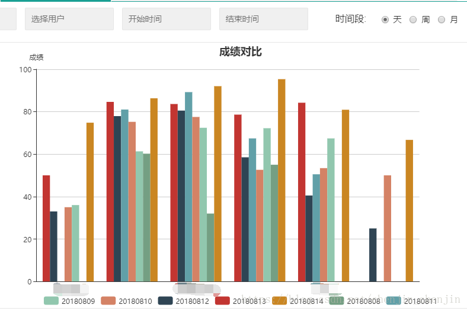
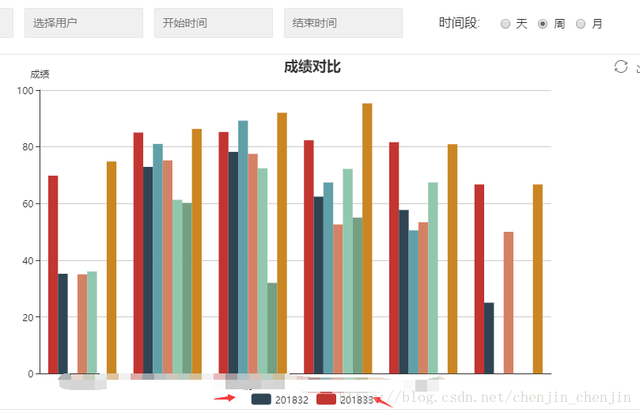

# 关于echarts数据二次渲染不成功

 最近在使用echarts做报表需求，二次生成报表时数据合并,无法正确显示。

第一次渲染：	第二次渲染：

可以看到这里的echarts项的series变为2个(如上图)，但是渲染后的效果series项还是和第一次相同。

解决办法：应该设置mychart.setoption({},true);

原因：chart.setOption(option,notMerge,lazyUpdate);

option:图表的配置项和数据

notMerge:可选，是否不跟之前设置的option进行合并，默认为false，即合并。（这里是导致二次渲染不成功的根本）

lazyUpdate:可选，在设置完option后是否不立即更新图表，默认为false，即立即更新。
