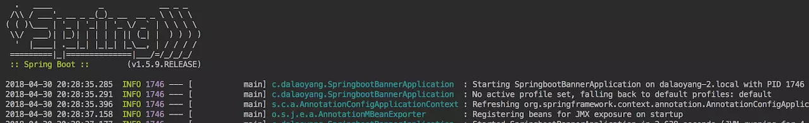

# SpringBoot启动banner更改

链接：https://juejin.im/post/5ae70e866fb9a07aaf34fda7

这篇文章的开始先给大家看一个图片




用过或者看过springboot的人都知道，这就是springboot启动的banner，这一篇介绍如何自定义springboot的启动bannner。

先介绍一个可以制作自定义banner的网站，传送门：[[http://patorjk.com/software/taag/#p=display&f=Crawford2&t=tian%20he%20fang%20wu%0A%0A](http://patorjk.com/software/taag/#p=display&f=Crawford2&t=tian he fang wu
)](https://link.juejin.im/?target=http%3A%2F%2Fpatorjk.com%2Fsoftware%2Ftaag%2F%23p%3Ddisplay%26f%3DGraffiti%26t%3DType%20Something%20)


黄框内输入自定义文字，红框内填写字体，本文使用banner

```
    ___        _        _           _        ____    _  _      _        _  _      ___
   F __".     /.\      FJ          /.\      F __ ]  FJ  LJ    /.\      F L L]   ,"___". 
  J |--\ L   //_\\    J |         //_\\    J |--| L J \/ F   //_\\    J   \| L  FJ---L] 
  | |  J |  / ___ \   | |        / ___ \   | |  | | J\  /L  / ___ \   | |\   | J |  [""L
  F L__J | / L___J \  F L_____  / L___J \  F L__J J  F  J  / L___J \  F L\\  J | \___] |
 J______/FJ__L   J__LJ________LJ__L   J__LJ\______/F|____|J__L   J__LJ__L \\__LJ\_____/F
 |______F |__L   J__||________||__L   J__| J______F |____||__L   J__||__L  J__| J_____F 
```


