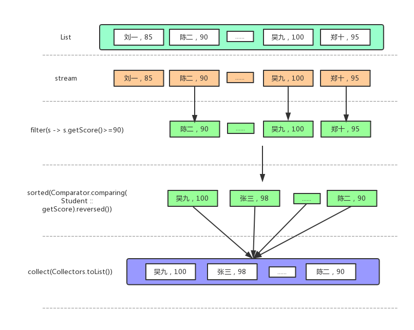

 Java8新了stream API，需要注意的是Stream和I/O中的流是没有关系的，这个stream主要是要来处理集合数据的，可以将其看作一个高级迭代器。在Collection接口中新增了非抽象的stream方法来获取集合的流。

 另外，Java8中新增了一个Optional类用于处理空指针异常，该类位于java.util包下，使用这个类可以更好的支持函数式编程，并且可以简化以前对null的判断。

  **stream**

下面定义一个Student类：


```java
public class Student {
    private String name;
    private int score;

    public Student(){

    }

    public Student(String name, int score) {
        super();
        this.name = name;
        this.score = score;
    }

    //setter和getter省略

    @Override
    public String toString() {
        return "[姓名=" + name + ", 分数=" + score + "]";
    }
    }
```

测试类：

```java
public class StreamTest01 {
    public static void main(String[] args) {
        List<Student> stuList = new ArrayList<>(10);
        stuList.add(new Student("刘一", 85));
        stuList.add(new Student("陈二", 90));
        stuList.add(new Student("张三", 98));
        stuList.add(new Student("李四", 88));
        stuList.add(new Student("王五", 83));
        stuList.add(new Student("赵六", 95));
        stuList.add(new Student("孙七", 87));
        stuList.add(new Student("周八", 84));
        stuList.add(new Student("吴九", 100));
        stuList.add(new Student("郑十", 95));
 
        //需求：列出90分以上的学生姓名，并按照分数降序排序
 
        //以前的写法，代码较多，每个操作都需要遍历集合
        List<Student> result1 = new ArrayList<>(10);
        //遍历集合获取分数大于90以上的学生并存放到新的List中
        for(Student s : stuList){
            if(s.getScore() >= 90){
                result1.add(s);
            }
        }
        //对List进行降序排序
        result1.sort(new Comparator<Student>(){
            @Override
            public int compare(Student s1, Student s2) {
                //降序排序
                return Integer.compare(s2.getScore(), s1.getScore());
            }
        });
        System.out.println(result1);
 
        //使用stream的写法
        /*
         * 1.获取集合的stream对象
         * 2.使用filter方法完成过滤
         * 3.使用sort方法完成排序
         * 4.使用collect方法将处理好的stream对象转换为集合对象
         */
        result1 = stuList.stream()
                .filter(s -> s.getScore()>=90)
                //.sorted((s1,s2) -> Integer.compare(s2.getScore(), s1.getScore()))
                //使用Comparator中的comparing方法
                .sorted(Comparator.comparing(Student :: getScore).reversed())
                .collect(Collectors.toList());
        System.out.println(result1);
    }
}

```



   **流的操作是内部迭代的**，之前使用诸如**for循环、迭代器属于外部迭代**。不过在java8中内部迭代的性能还是略差一些，相信在后面的版本中会有所提升。**注意：流只能使用一次，使用结束之后，这个流也就废掉了。**

### **map和reduce**

- map用来**归类**，结果一般是一组数据，比如可以将list中的学生分数映射到一个新的stream中。
- reduce用来**计算值**，结果是一个值，比如计算最高分。

 

```java
public class StreamTest02 {
 
    public static void main(String[] args) {
        //初始化List数据同上
        List<Student> list = InitData.getStudent();
        //使用map方法获取list数据中的name
        List<String> names = list.stream().map(Student::getName).collect(Collectors.toList());
        System.out.println(names);
 
        //使用map方法获取list数据中的name的长度
        List<Integer> length = list.stream().map(Student::getName).map(String::length).collect(Collectors.toList());
        System.out.println(length);
 
        //将每人的分数-10
        List<Integer> score = list.stream().map(Student::getScore).map(i -> i - 10).collect(Collectors.toList());
        System.out.println(score);
 
        //计算学生总分
        Integer totalScore1 = list.stream().map(Student::getScore).reduce(0,(a,b) -> a + b);
        System.out.println(totalScore1);
 
        //计算学生总分，返回Optional类型的数据，改类型是java8中新增的，主要用来避免空指针异常
        Optional<Integer> totalScore2 = list.stream().map(Student::getScore).reduce((a,b) -> a + b);
        System.out.println(totalScore2.get());
 
        //计算最高分和最低分
        Optional<Integer> max = list.stream().map(Student::getScore).reduce(Integer::max);
        Optional<Integer> min = list.stream().map(Student::getScore).reduce(Integer::min);
 
        System.out.println(max.get());
        System.out.println(min.get());
    }
}

```

**数值流**

上面代码中

```java
Optional<Integer> totalScore2 = list.stream()
                .map(Student::getScore)
                .reduce((a,b) -> a + b);
```

如果要是在Stream中有一个sum方法的话，可以修改为

```java
Optional<Integer> totalScore2 = list.stream()
                .map(Student::getScore)
                .sum();
```

不过没有，但是在java8中新增了三个原始类型流（IntStream、DoubleStream、LongStream）来解决这个问题，

```java

//数值流
public class StreamTest03 {
    public static void main(String[] args) {
        List<Student> list = InitData.getStudent();
 
        //将stream转换为IntStream
        int totalScore = list.stream().mapToInt(Student::getScore).sum();
        System.out.println(totalScore);
 
        //计算平均分
        OptionalDouble avgScore = list.stream().mapToInt(Student::getScore).average();
        System.out.println(avgScore.getAsDouble());
 
        //生成1~100之间的数字
        IntStream num = IntStream.rangeClosed(1, 100);
 
        //计算1~100之间的数字中偶数的个数
        long count = IntStream.rangeClosed(1, 100).filter(n -> n%2 == 0).count();
        System.out.println(count);
    }
}

```

**创建流**

除了上面的流之外，我们还可以自己创建流。下面代码中展示了三种创建流的方式：

```java

//使用Stream.of创建流
    Stream<String> str =  Stream.of("i","love","this","game");
    str.map(String::toUpperCase).forEach(System.out::println);
 
    //使用数组创建流
    int[] num = {2,5,9,8,6};
    IntStream intStream = Arrays.stream(num);
    int sum = intStream.sum();//求和
    System.out.println(sum);
 
    //由函数生成流，创建无限流
    Stream.iterate(0, n -> n+2).limit(10).forEach(System.out::println);
```

### Optional类

两个作用：（1）解决空指针异常  （2）支持函数式编程，所以使用它可以简化代码

例子：

```java

public class TestOptional {
    public static void main(String[] args) {
        List<Student> studentList = InitData.getStudent();
        //计算分数在60分一下的分数总和
        Optional<Integer> score = studentList.stream()
                .map(Student :: getScore)
                .filter(s -> s<60)
                .reduce((a,b) -> a+b); //没有60分以下的，以前不加判断就会出现空指针异常
        System.out.println(score.orElse(0));   //0
 
        Map<Integer,String> map = new HashMap<>();
        map.put(20180001,"章子");
        map.put(20180002,"小米");
        map.put(20180003,"大黄");
        map.put(20180004,"靓妹");
 
        String name = Optional.ofNullable(map.get(20180005)).orElse("无");
        System.out.println(name);  //无
    }
}
```

