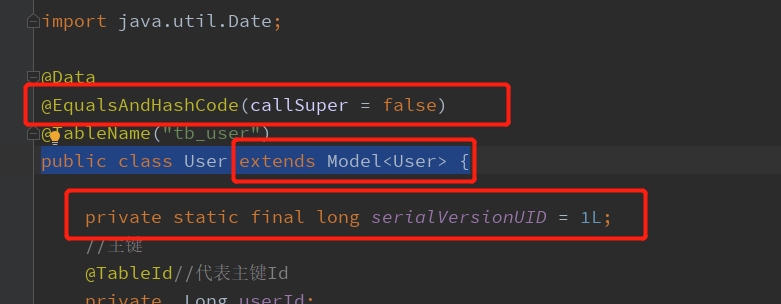

//新增

```
//新增
@Test
public void insert(){
    User user = new User();
    user.setUsername("范儿1");
    user.setPassword("123455");
    user.setMobile("15035963136");
    user.setCreateTime(new Date());
    //直接在实体类中操作
    boolean insert = user.insert();
    System.out.println("影响记录数"+insert);
}
```

