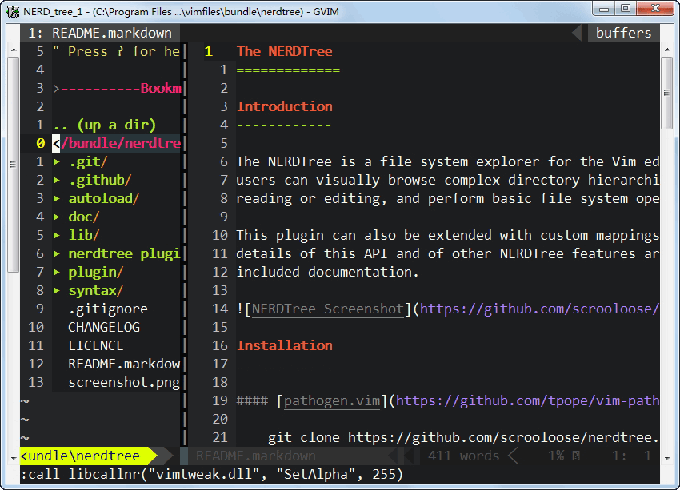

[NERDTree](https://mounui.com/wp-content/themes/begin/inc/go.php?url=https://github.com/scrooloose/nerdtree) 是一款目录树资源管理工具，它的作用就是列出当前路径的目录树，可以方便的浏览项目的总体的目录结构和创建删除重命名文件或文件名。

	

## 一、安装

\1. 下载 nerdtree 插件并放到 [vim](https://mounui.com/tag/vim/) 的安装目录下的插件目录中。

\2. 使用 [Vundle插件管理器](https://mounui.com/179.html) 安装 `Plugin 'scrooloose/nerdtree'`。

## 二、配置

以下是我的 `nerdtree` 仅供参考，更多配置请查看帮助 `:h NERDTree

```shell
map <leader>ne :NERDTreeToggle<CR>
" 目录树窗口尺寸
let g:NERDTreeWinSize = 20
" 关闭nerd帮助
" let g:NERDTreeMinimalUI = 1
" 忽略以下文件的显示
let NERDTreeIgnore=['\.pyc','\~$','\.swp']
" 显示书签列表
let NERDTreeShowBookmarks=1
" 显示隐藏文件
let NERDTreeShowHidden=1
" 修改默认箭头符号
let g:NERDTreeDirArrowExpandable = '▸'
let g:NERDTreeDirArrowCollapsible = '▾'
augroup NERDTree
    au!
    autocmd vimenter * NERDTree     " vim启动时自动打开NERDTree
    " vim启动打开目录时自动打开NERDTree
    autocmd StdinReadPre * let s:std_in=1
    autocmd VimEnter * if argc() == 1 && isdirectory(argv()[0]) && !exists("s:std_in") | exe 'NERDTree' argv()[0] | wincmd p | ene | endif
    " 文件全部关闭时退出NERDTree
    autocmd bufenter * if (winnr("$") == 1 && exists("b:NERDTree") && b:NERDTree.isTabTree()) | q | endif
augroup END
```

## 三、基本使用

`NERDTree` 的一些基本操作

```
?: 快速帮助文档
o: 打开一个目录或者打开文件，创建的是buffer，也可以用来打开书签
go: 打开一个文件，但是光标仍然留在NERDTree，创建的是buffer
t: 打开一个文件，创建的是Tab，对书签同样生效
T: 打开一个文件，但是光标仍然留在NERDTree，创建的是Tab，对书签同样生效
i: 水平分割创建文件的窗口，创建的是buffer
gi: 水平分割创建文件的窗口，但是光标仍然留在NERDTree
s: 垂直分割创建文件的窗口，创建的是buffer
gs: 和gi，go类似
x: 收起当前打开的目录
X: 收起所有打开的目录
e: 以文件管理的方式打开选中的目录
D: 删除书签
P: 大写，跳转到当前根路径
p: 小写，跳转到光标所在的上一级路径
K: 跳转到第一个子路径
J: 跳转到最后一个子路径
<C-j>和<C-k>: 在同级目录和文件间移动，忽略子目录和子文件
C: 将根路径设置为光标所在的目录
u: 设置上级目录为根路径
U: 设置上级目录为跟路径，但是维持原来目录打开的状态
r: 刷新光标所在的目录
R: 刷新当前根路径
I: 显示或者不显示隐藏文件
f: 打开和关闭文件过滤器
q: 关闭NERDTree
A: 全屏显示NERDTree，或者关闭全屏
```

​		